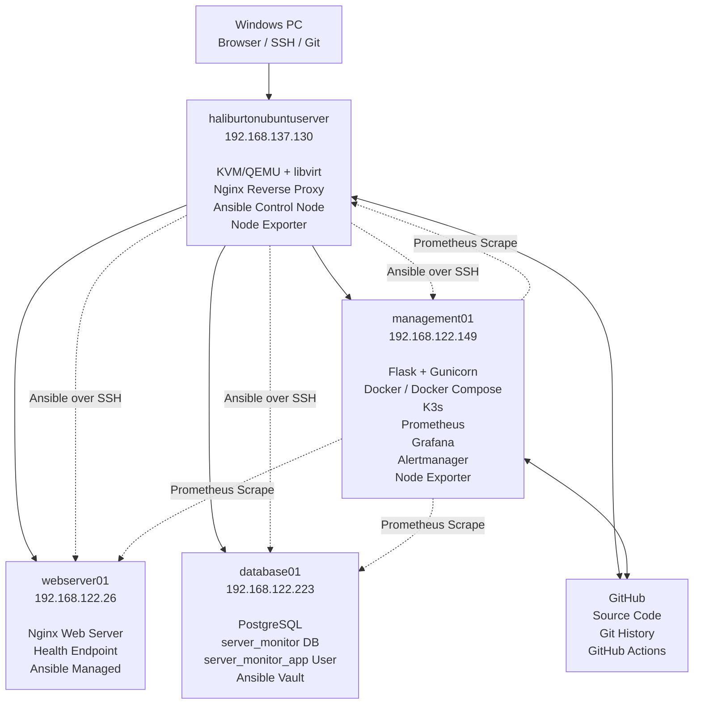

# Automated Cloud Infrastructure & Monitoring Lab

> A multi-node Linux home lab for infrastructure automation, containerized application deployment, centralized monitoring, and service provisioning.

**Status:** Ongoing development  
**Current repository name:** `server-monitor`  
**Recommended project name for CV:** **Automated Cloud Infrastructure & Monitoring Lab**

---

## 1. Project Overview

This project started as a small Python script that connected to a Linux server through SSH and collected system information. It has since evolved into a multi-node infrastructure lab running on KVM/QEMU.

The lab currently includes:

- A KVM/QEMU hypervisor
- Three Ubuntu Server virtual machines
- A Python/Flask monitoring application
- Docker and Docker Compose deployments
- A K3s/Kubernetes deployment
- Nginx reverse proxy
- Prometheus, Grafana, Alertmanager, and Node Exporter
- PostgreSQL
- Ansible roles and Ansible Vault
- GitHub Actions for basic CI validation

The main goal is to practice the tasks commonly performed by System Engineers, Cloud Support Engineers, DevOps Engineers, and entry-level SREs.

---

## 2. Project Objectives

The project is designed to demonstrate how to:

- Build and manage Linux virtual machines
- Automate initial VM provisioning
- Collect server information through SSH
- Package an application into a Docker image
- Operate a multi-container monitoring stack
- Deploy an application to Kubernetes/K3s
- Configure centralized access through Nginx
- Monitor multiple Linux nodes
- Automate Linux, web server, and database configuration
- Protect infrastructure credentials with Ansible Vault
- Manage infrastructure code using Git and GitHub
- Validate project changes through GitHub Actions

---

## 3. Architecture



---

## 4. Lab Nodes

| Node | IP address | Main role |
|---|---:|---|
| `haliburtonubuntuserver` | `192.168.137.130` | Hypervisor, Nginx reverse proxy, Ansible control node |
| `management01` | `192.168.122.149` | Application, Docker, K3s, monitoring stack |
| `webserver01` | `192.168.122.26` | Nginx web server managed by Ansible |
| `database01` | `192.168.122.223` | PostgreSQL server managed by Ansible |

The VM network uses the libvirt subnet:

```text
192.168.122.0/24
```

---

## 5. Service Access

Nginx on the hypervisor provides centralized access:

| Path | Backend |
|---|---|
| `/` | Flask monitoring dashboard |
| `/grafana/` | Grafana |
| `/prometheus/` | Prometheus |
| `/alertmanager/` | Alertmanager |

Example:

```text
http://192.168.137.130/
http://192.168.137.130/grafana/
http://192.168.137.130/prometheus/
http://192.168.137.130/alertmanager/
```

Internal service ports on `management01`:

| Service | Port |
|---|---:|
| Flask/Gunicorn | `5000` |
| Grafana | `3000` |
| Prometheus | `9090` |
| Alertmanager | `9093` |
| Node Exporter | `9100` |

---

## 6. Technology Stack and Its Purpose

| Technology | How it is used in this project |
|---|---|
| **Linux / Ubuntu Server** | Hosts the hypervisor and all virtual machines; provides SSH, systemd, networking, package management, logs, and service administration |
| **KVM/QEMU** | Provides hardware-assisted virtualization for the lab |
| **libvirt / virsh** | Creates, starts, stops, and inspects virtual machines and virtual networks |
| **Cloud-init** | Automates initial VM hostname, user, SSH, sudo, and package configuration |
| **Python** | Implements the server monitoring application and automation logic |
| **Paramiko** | Connects to remote Linux servers over SSH and collects system information |
| **Flask** | Provides the monitoring web dashboard and API endpoints |
| **Gunicorn** | Runs the Flask application with a production-style WSGI server |
| **Docker** | Packages the Flask application and its dependencies into a reproducible container image |
| **Docker Compose** | Defines and operates the Prometheus, Grafana, Alertmanager, and Node Exporter monitoring stack |
| **K3s / Kubernetes** | Deploys the Flask application using Deployment, Service, and Ingress resources |
| **Nginx** | Acts as a reverse proxy on the hypervisor and as the web server on `webserver01` |
| **Prometheus** | Scrapes and stores time-series infrastructure metrics |
| **Node Exporter** | Exposes CPU, memory, filesystem, network, load, and uptime metrics |
| **Grafana** | Visualizes Prometheus metrics in dashboards |
| **Alertmanager** | Receives and manages alerts generated by Prometheus |
| **PostgreSQL** | Provides the application database on `database01` |
| **Ansible** | Automates Linux baseline configuration, Nginx deployment, and PostgreSQL provisioning |
| **Ansible Vault** | Encrypts the PostgreSQL application password stored in the repository |
| **Bash** | Supports build, deploy, restart, rollback, cleanup, logs, status, backup, and health-check tasks |
| **Git / GitHub** | Provides source control, history, collaboration, and synchronization between lab nodes |
| **GitHub Actions** | Runs basic automated validation after changes are pushed |

---

## 7. Current Features

### Virtualization

- KVM acceleration enabled
- QEMU/libvirt environment configured
- Ubuntu cloud image used as the VM base image
- VM disks created using QCOW2
- Cloud-init seed images used during provisioning
- Multiple Ubuntu Server VMs created and tested

### Python Monitoring Application

The Flask application can collect server information over SSH using Paramiko, including:

- Hostname
- CPU usage
- Memory usage
- Disk usage
- Uptime
- Nginx service status

The application is served with Gunicorn and can run inside Docker.

### Docker

The application is containerized so that it can run with a consistent Python environment and dependency set.

Typical container workflow:

```bash
docker build -t server-monitor:v2 .
docker run -d \
  --name server-monitor \
  -p 5000:5000 \
  server-monitor:v2
```

### Docker Compose Monitoring Stack

The monitoring stack currently contains:

```text
Prometheus
Grafana
Alertmanager
Node Exporter
```

Start the stack:

```bash
cd ~/server-monitor/monitoring
docker compose up -d
```

Check status:

```bash
docker compose ps
```

View logs:

```bash
docker compose logs --tail=100
```

Stop the stack:

```bash
docker compose down
```

### Kubernetes / K3s

The Flask application has been deployed to K3s using:

- Deployment
- Service
- Ingress
- `kubectl`

Typical commands:

```bash
kubectl get nodes
kubectl get pods -A
kubectl get deployments
kubectl get services
kubectl get ingress
```

Apply Kubernetes manifests:

```bash
kubectl apply -f k8s/
```

> This project currently uses K3s as a single-node learning environment. It is not presented as a production or high-availability Kubernetes cluster.

### Nginx Reverse Proxy

Nginx on the hypervisor routes browser requests to services running on `management01`.

Example reverse-proxy paths:

```text
/               -> Flask dashboard
/grafana/       -> Grafana
/prometheus/    -> Prometheus
/alertmanager/  -> Alertmanager
```

Validate and reload Nginx:

```bash
sudo nginx -t
sudo systemctl reload nginx
```

### Centralized Monitoring

Prometheus collects Linux host metrics through Node Exporter. Grafana is used to visualize these metrics.

Current monitoring components:

- Prometheus
- Grafana
- Alertmanager
- Node Exporter
- Multiple Linux nodes

Example verification:

```bash
curl http://127.0.0.1:9100/metrics
curl http://192.168.122.149:9090/-/healthy
curl http://192.168.122.149:9093/-/healthy
```

### Ansible Automation

The hypervisor acts as the Ansible control node.

Managed inventory:

```text
management01
webserver01
database01
```

Current Ansible roles:

```text
common
webserver
database
```

#### `common` role

Automates:

- APT cache update
- Common Linux packages
- Timezone configuration
- Chrony service
- Operational directories
- Ansible management marker

#### `webserver` role

Automates:

- Nginx installation
- Document root creation
- HTML page deployment
- Nginx virtual host configuration
- Health endpoint
- Nginx service enablement

Health check:

```bash
curl -i http://192.168.122.26/health
```

Expected response:

```text
HTTP/1.1 200 OK

healthy
```

#### `database` role

Automates:

- PostgreSQL installation
- PostgreSQL service enablement
- Application database creation
- Application user creation
- Database ownership assignment
- Database validation

Current database objects:

```text
Database: server_monitor
User:     server_monitor_app
```

### Ansible Vault

The PostgreSQL application password is stored in an encrypted Vault file.

Example:

```bash
ansible-vault view group_vars/databases/vault.yml
```

Run a database playbook:

```bash
ansible-playbook \
  playbooks/deploy_database.yml \
  --ask-vault-pass
```

> Vault passwords, private SSH keys, tokens, and plaintext application credentials must never be committed to the repository.

---

## 8. Ansible Inventory

Example inventory:

```yaml
all:
  vars:
    ansible_user: hoangan1606
    ansible_ssh_private_key_file: /home/hoangan1606/.ssh/ansible_ed25519
    ansible_python_interpreter: /usr/bin/python3

  children:
    management:
      hosts:
        management01:
          ansible_host: 192.168.122.149

    webservers:
      hosts:
        webserver01:
          ansible_host: 192.168.122.26

    databases:
      hosts:
        database01:
          ansible_host: 192.168.122.223

    monitored_nodes:
      children:
        management:
        webservers:
        databases:
```

Check inventory:

```bash
cd ~/server-monitor/ansible
ansible-inventory --graph
```

Test connectivity:

```bash
ansible all -m ansible.builtin.ping
```

Expected result:

```text
management01 | SUCCESS => ping: pong
webserver01  | SUCCESS => ping: pong
database01   | SUCCESS => ping: pong
```

---

## 9. Main Ansible Commands

Validate node information:

```bash
ansible-playbook playbooks/check_nodes.yml
```

Apply common configuration:

```bash
ansible-playbook playbooks/apply_common.yml
```

Deploy Nginx web server:

```bash
ansible-playbook playbooks/deploy_webserver.yml
```

Deploy PostgreSQL:

```bash
ansible-playbook \
  playbooks/deploy_database.yml \
  --ask-vault-pass
```

Check syntax:

```bash
ansible-playbook \
  --syntax-check \
  playbooks/deploy_webserver.yml
```

Test idempotency by running the same playbook twice. The second run should produce:

```text
changed=0
failed=0
unreachable=0
```

---

## 10. Repository Structure

The high-level project structure is organized as follows:

```text
server-monitor/
├── ansible/
│   ├── ansible.cfg
│   ├── collections/
│   │   └── requirements.yml
│   ├── group_vars/
│   │   └── databases/
│   │       └── vault.yml
│   ├── inventories/
│   │   └── lab/
│   │       └── hosts.yml
│   ├── playbooks/
│   │   ├── apply_common.yml
│   │   ├── check_nodes.yml
│   │   ├── deploy_database.yml
│   │   └── deploy_webserver.yml
│   └── roles/
│       ├── common/
│       ├── database/
│       └── webserver/
├── monitoring/
│   ├── alertmanager/
│   │   └── alertmanager.yml
│   ├── alert.rules.yml
│   ├── docker-compose.yml
│   └── prometheus.yml
├── k8s/
│   ├── deployment.yaml
│   ├── service.yaml
│   └── ingress.yaml
├── .github/
│   └── workflows/
├── Dockerfile
├── requirements.txt
└── README.md
```

> Some application or script file names may differ as the repository continues to evolve.

---

## 11. Getting Started

### Prerequisites

The control environment should have:

- Ubuntu Server
- Git
- Python 3
- Docker
- Docker Compose plugin
- Ansible
- KVM/QEMU and libvirt
- SSH access to all managed VMs

### Clone the repository

```bash
git clone <YOUR_REPOSITORY_URL>
cd server-monitor
```

### Install Ansible collections

```bash
cd ansible

ansible-galaxy collection install \
  -r collections/requirements.yml
```

### Configure SSH access

Create a dedicated Ansible key:

```bash
ssh-keygen \
  -t ed25519 \
  -f ~/.ssh/ansible_ed25519 \
  -C "ansible-control"
```

Copy it to each VM:

```bash
ssh-copy-id \
  -i ~/.ssh/ansible_ed25519.pub \
  hoangan1606@192.168.122.149

ssh-copy-id \
  -i ~/.ssh/ansible_ed25519.pub \
  hoangan1606@192.168.122.26

ssh-copy-id \
  -i ~/.ssh/ansible_ed25519.pub \
  hoangan1606@192.168.122.223
```

### Configure the Vault secret

Create or edit the encrypted Vault file:

```bash
EDITOR=nano ansible-vault create \
  group_vars/databases/vault.yml
```

Vault variable example:

```yaml
---
vault_postgresql_app_password: "REPLACE_WITH_A_STRONG_PASSWORD"
```

### Verify Ansible

```bash
ansible-inventory --graph
ansible all -m ansible.builtin.ping
ansible-playbook playbooks/check_nodes.yml
```

### Start the monitoring stack

```bash
cd ../monitoring
docker compose up -d
docker compose ps
```

### Validate Nginx reverse proxy

On the hypervisor:

```bash
sudo nginx -t
sudo systemctl reload nginx
```

---

## 12. Git and GitHub Workflow

Typical workflow:

```bash
git status
git add .
git commit -m "Describe the change"
git pull --rebase origin main
git push origin main
```

The project uses a dedicated GitHub SSH key on the hypervisor.

Example SSH configuration:

```sshconfig
Host github.com
    HostName github.com
    User git
    IdentityFile ~/.ssh/github_ed25519
    IdentitiesOnly yes
```

Test GitHub authentication:

```bash
ssh -T git@github.com
```

---

## 13. GitHub Actions

GitHub Actions is used for basic continuous integration.

The workflow currently validates project changes after a push. The CI workflow can be expanded to include:

- Python syntax checks
- Unit tests
- YAML validation
- Ansible syntax checks
- `ansible-lint`
- Docker image builds
- Kubernetes manifest validation

Official actions used by the workflow should use the `actions/` organization, for example:

```yaml
- uses: actions/checkout@v4
- uses: actions/setup-python@v5
```

---

## 14. Verification Checklist

The current environment can be checked with the following commands.

### Hypervisor

```bash
virsh list --all
sudo systemctl status nginx
sudo docker ps
```

### Management node

```bash
docker ps
docker compose -f monitoring/docker-compose.yml ps
kubectl get pods -A
kubectl get services
kubectl get ingress
```

### Web server

```bash
curl -i http://192.168.122.26/health
```

### Database server

```bash
ansible database01 \
  -b \
  -m ansible.builtin.command \
  -a "systemctl is-active postgresql"
```

```bash
ansible database01 \
  -b \
  --become-user postgres \
  -m ansible.builtin.command \
  -a "psql -tAc \"SELECT datname FROM pg_database WHERE datname='server_monitor';\""
```

### Monitoring

```bash
curl http://192.168.122.149:9090/-/healthy
curl http://192.168.122.149:9093/-/healthy
curl http://192.168.122.149:9100/metrics
```

---

## 15. Current Progress

| Area | Status |
|---|---:|
| Linux home lab | Completed |
| KVM/QEMU virtualization | Completed |
| Cloud-init VM provisioning | Completed |
| Python/Flask monitoring application | Completed |
| Docker containerization | Completed |
| Docker Compose monitoring stack | Completed |
| K3s deployment | Completed at basic lab level |
| Nginx reverse proxy | Completed |
| Prometheus and Grafana | Completed at baseline level |
| Alertmanager deployment | Completed |
| Ansible control node and inventory | Completed |
| Ansible `common` role | Completed |
| Ansible `webserver` role | Completed |
| Ansible `database` role | Completed |
| Ansible Vault | Completed |
| PostgreSQL remote-access restriction | In progress |
| Ansible Node Exporter role | Planned |
| Full `site.yml` deployment | Planned |
| Alert notifications | Planned |
| Database backup and restore | Planned |
| Security hardening | Planned |
| Loki and Promtail | Future enhancement |
| Terraform/OpenTofu | Future enhancement |
| OpenStack | Future phase |

---

## 16. Remaining Work

The following tasks are planned before the current project is considered complete.

### Infrastructure automation

- Create a reusable `node_exporter` role
- Automate the monitoring stack through Ansible
- Add a full `site.yml` playbook
- Rebuild the complete lab from a single Ansible command
- Verify idempotency across all roles

### PostgreSQL security

- Configure PostgreSQL to listen on the internal network
- Restrict `pg_hba.conf` to `management01`
- Restrict port `5432` through UFW
- Connect the Flask application to PostgreSQL

Target policy:

```text
management01 -> database01:5432  ALLOWED
webserver01  -> database01:5432  DENIED
other hosts  -> database01:5432  DENIED
```

### Monitoring and alerting

- Add `NodeDown`
- Add `HighCPUUsage`
- Add `HighMemoryUsage`
- Add `HighDiskUsage`
- Add `NginxDown`
- Add `PostgreSQLDown`
- Configure one notification channel
- Test both `FIRING` and `RESOLVED` states

### Backup and recovery

- Automate PostgreSQL backup using `pg_dump`
- Store backups under `/opt/lab/backups`
- Add backup retention
- Perform and document a successful restore test

### CI and quality

- Add Python tests
- Add YAML validation
- Add Ansible syntax checks
- Add `ansible-lint`
- Add Docker image build validation

### Documentation

- Add screenshots of Grafana
- Add screenshots of successful Ansible runs
- Add screenshots of GitHub Actions
- Document common failures and troubleshooting steps

---

## 17. Security Notes

- Never commit private SSH keys
- Never commit GitHub tokens
- Never commit plaintext database passwords
- Keep the Ansible Vault password outside the repository
- Restrict permissions on Vault and SSH files
- Use specific Docker image versions before a production-style release
- Limit PostgreSQL access to required hosts only
- Limit firewall ports to required services only
- Disable direct root SSH login
- Review exposed monitoring interfaces before using the lab outside a private network

Suggested permissions:

```bash
chmod 700 ~/.ssh
chmod 600 ~/.ssh/ansible_ed25519
chmod 600 ~/.ssh/github_ed25519
chmod 600 ansible/group_vars/databases/vault.yml
```

---

## 18. Troubleshooting Notes

### Docker mount error

Error:

```text
Are you trying to mount a directory onto a file?
```

Cause:

```text
alertmanager/alertmanager.yml
```

was accidentally created as a directory instead of a file.

Fix:

```bash
sudo rm -rf alertmanager/alertmanager.yml
touch alertmanager/alertmanager.yml
```

### Alertmanager configuration typo

Incorrect:

```yaml
--confi.file=/etc/alertmanager/alertmanager.yml
```

Correct:

```yaml
--config.file=/etc/alertmanager/alertmanager.yml
```

Incorrect port mapping:

```yaml
9093:9039
```

Correct:

```yaml
9093:9093
```

### Ansible Jinja filter typo

Incorrect:

```yaml
{{ ansible_default_ipv4.address | dafault('N/A') }}
```

Correct:

```yaml
{{ ansible_default_ipv4.address | default('N/A') }}
```

### GitHub Actions action name typo

Incorrect:

```yaml
uses: action/setup-python@v5
```

Correct:

```yaml
uses: actions/setup-python@v5
```

### Nginx configuration warning

A warning such as:

```text
conflicting server name "_" on 0.0.0.0:80
```

means multiple enabled server blocks are using the same default server name or listen configuration.

Inspect:

```bash
ls -l /etc/nginx/sites-enabled
grep -R "server_name _" /etc/nginx/sites-enabled
```

---

## 19. Project Value

This project demonstrates a complete infrastructure workflow:

```text
Provision VMs
-> Configure Linux
-> Deploy an application
-> Containerize the application
-> Deploy to Kubernetes
-> Configure a web server
-> Provision a database
-> Monitor infrastructure
-> Automate configuration
-> Protect secrets
-> Manage code with Git
-> Validate changes with CI
```

It is relevant to entry-level roles such as:

- System Engineer
- Linux System Administrator
- Cloud Support Engineer
- Infrastructure Engineer
- DevOps Intern
- SRE Intern
- OpenStack System Engineer

---


## 20. Future Enhancements

After completing the current project, possible future phases include:

- Loki and Promtail for centralized log collection
- Terraform or OpenTofu for infrastructure provisioning
- Multi-node Kubernetes
- High-availability monitoring
- OpenStack deployment
- Nova, Neutron, Cinder, and Horizon
- Monitoring and automation for OpenStack services

These are future improvements and are not presented as completed features.

---

## 21. Author

**Đinh Hoàng Ân**

Final-year Electronics and Telecommunications student specializing in Computer Networks, with practical experience in Linux, networking, infrastructure automation, monitoring, and system testing.

---

## 22. License

This project is intended for learning, portfolio, and home-lab purposes.

You may add a license such as the MIT License before publishing the repository publicly.
